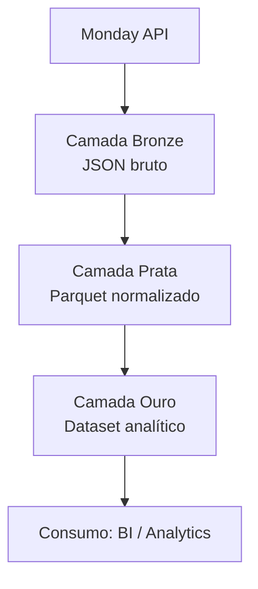

# 📦 Umane DataLake — Pipeline Monday → S3

Pipeline leve e automatizado para ingestão e transformação de dados da plataforma **Monday.com**, organizado em camadas de Data Lake: **Bronze → Prata → Ouro**, armazenadas na AWS S3.

---

## 🚀 Visão Geral

Este projeto executa:

1. **Extração** dos itens de um board Monday via API GraphQL  
2. **Armazenamento bruto** na camada **bronze** (JSON versionado por timestamp)  
3. **Transformação incremental** para a camada **prata** (Parquet estruturado)  
4. **Modelagem analítica** para a camada **ouro** (dataset limpo e pronto para BI)

---

## 🌐 Arquitetura do Pipeline (Diagrama Mermaid)



---

## 🧱 Arquitetura das Camadas

### 🔹 Bronze — RAW  
- JSON bruto retornado pela API Monday  
- Particionado por `YYYYMM/`  
- Nenhuma transformação aplicada  

### 🔸 Prata — Normalizada  
- Registros tabulares gerados a partir do JSON  
- Tratamento de colunas complexas (mirror, subtasks, relations)  
- Apenas arquivos *novos* são processados (incremental)

### 🟡 Ouro — Curada  
- Padronização de nomes das colunas  
- Criação de ID estável por item  
- Conversões numéricas e somatórios  
- Adequada para análises e dashboards

---

## 📂 Estrutura dos Buckets S3

```
s3://umane-datalake-bronze/monday/funil_originacao/YYYYMM/monday_raw_TIMESTAMP.json
s3://umane-datalake-prata/monday/funil_originacao/YYYYMM/monday_items_TIMESTAMP.parquet
s3://umane-datalake-ouro/monday/funil_originacao/YYYYMM/monday_gold_TIMESTAMP.parquet
```

---

## 🔧 Instalação

Criar ambiente virtual:

```bash
python -m venv venv
venv\Scripts\activate  # Windows
source venv/bin/activate  # Linux/Mac
```

Instalar dependências:

```bash
pip install -r requirements.txt
```

---

## 🔐 Variáveis de Ambiente

Crie um arquivo `.env`:

```
MONDAY_API_TOKEN=seu_token
AWS_ACCESS_KEY_ID=xxxxx
AWS_SECRET_ACCESS_KEY=yyyyy
AWS_DEFAULT_REGION=us-east-1
```

---

## ▶️ Execução do Pipeline

Execute:

```bash
python -m umane_datalake.pipeline
```

O pipeline realiza:

- extração → bronze  
- bronze novo → prata  
- prata → ouro  
- salvamento incremental no S3  

---

## 🗂 Estrutura dos Módulos

| Módulo | Função |
|--------|--------|
| `config.py` | Carregamento de variáveis de ambiente |
| `monday_client.py` | Cliente GraphQL com paginação da API |
| `s3_client.py` | Salvamento de JSON e Parquet no S3 |
| `transformacao.py` | Bronze → Prata (incremental) |
| `transformacao_ouro.py` | Prata → Ouro (modelagem final) |
| `pipeline.py` | Orquestração completa do fluxo |

---

## 📜 Licença

Defina aqui a licença do projeto (ex.: MIT, Apache 2.0).
