# Umane Data Lake — Monday Pipeline — Arquitetura Completa

## 🚀 Introdução

O projeto **Umane Data Lake** foi desenvolvido para criar um pipeline robusto, automatizado e escalável, responsável por coletar dados da plataforma **Monday.com**, organizá-los em camadas de um Data Lake moderno (**Bronze, Silver e Gold**) e disponibilizá-los para análises e uso estratégico.

---

# 🏛 Visão Geral da Arquitetura

```
Monday API → Bronze → Silver → Gold → BI/Analytics
```

## 🔍 Diagrama Geral do Pipeline

```mermaid
flowchart TD

A[GitHub Actions<br/>Workflow diário] --> B[run_pipeline()]
B --> C[Extração Monday API<br/>GraphQL + paginação]
C --> D[Salvar Bronze<br/>JSON no S3]
D --> E[Transformação Bronze → Silver<br/>flatten + normalização]
E --> F[Camada Silver<br/>Parquet no S3]
F --> G[Transformação Silver → Gold<br/>curadoria]
G --> H[Camada Gold<br/>Dataset analítico]

style A fill:#2e83ff,stroke:#1c4b99,color:white
style D fill:#ffcc66,stroke:#b8860b,color:#000
style F fill:#b3e6ff,stroke:#006b99,color:#000
style H fill:#00a86b,stroke:#006b43,color:#fff
```

---

# ⚙️ Orquestração — GitHub Actions

A pipeline executa diariamente às **06:00 (UTC−3)** utilizando GitHub Actions:

```yaml
name: pipeline

on:
  workflow_dispatch:
  schedule:
    - cron: "0 9 * * *"

jobs:
  run:
    runs-on: ubuntu-latest
    steps:
      - uses: actions/checkout@v3
      - uses: actions/setup-python@v4
        with:
          python-version: "3.12"
      - run: pip install -r requirements.txt
      - name: Run pipeline
        env:
          MONDAY_API_TOKEN: ${{ secrets.MONDAY_API_TOKEN }}
          AWS_ACCESS_KEY_ID: ${{ secrets.AWS_ACCESS_KEY_ID }}
          AWS_SECRET_ACCESS_KEY: ${{ secrets.AWS_SECRET_ACCESS_KEY }}
          AWS_DEFAULT_REGION: "us-east-1"
        run: |
          export PYTHONPATH="$PYTHONPATH:src"
          python -c "from umane_datalake.pipeline import run_pipeline; run_pipeline()"
```

---

# 🧩 Módulos Internos

## monday_client.py
Responsável por extrair dados da API Monday:

- autenticação via token  
- paginação cursor-based  
- normalização de colunas complexas  


---

# 🥉 Camada Bronze

Os dados crus são salvos em JSON:

```
s3://umane-datalake-bronze/.../monday_raw_timestamp.json
```

---

# 🥈 Camada Silver

Conversão Bronze → Silver via `transformacao.py`:

- flatten de colunas  
- normalização  
- transformação incremental  
- saída em Parquet  


---

# 🥇 Camada Gold

Curadoria final via `transformacao_ouro.py`:

- normalização snake_case  
- uuid5 determinístico  
- somatória de colunas compostas  
- dataset pronto para BI  

```mermaid
flowchart TD
A[Silver Parquet] --> B[normalização]
B --> C[uuid5]
C --> D[tratamento numérico]
D --> E[Gold Parquet]
```



---

# 🎯 Pipeline Principal — run_pipeline()


---

# ▶ Execução Local

```bash
pip install -r requirements.txt
export PYTHONPATH="$PYTHONPATH:src"
export MONDAY_API_TOKEN="..."
export AWS_ACCESS_KEY_ID="..."
export AWS_SECRET_ACCESS_KEY="..."
python -c "from umane_datalake.pipeline import run_pipeline; run_pipeline()"
```

---

# 🔐 Secrets Necessários

| Nome | Descrição |
|------|-----------|
| MONDAY_API_TOKEN | Token da API Monday |
| AWS_ACCESS_KEY_ID | Access key AWS |
| AWS_SECRET_ACCESS_KEY | Secret key AWS |
| AWS_DEFAULT_REGION | Região AWS |

---

## 📜 Licença

Defina aqui a licença do projeto (ex.: MIT, Apache 2.0).
